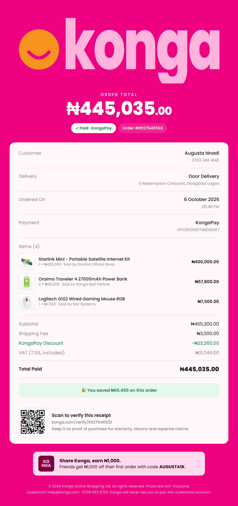

# Konga Receipt: product proposal

**One line:** after every order, give customers a receipt designed like the bank receipts Nigerians already save and share, so each purchase leaves behind a piece of Konga that is trusted, useful, and seen by other people.

---

## 1. The problem

Today a Konga order ends with a confirmation email (gray tables, blue links, four phone numbers, a scam warning). It does its job, but:

- **It's hard to use as proof.** Customers who need proof of purchase (warranty, returns, office reimbursement, a spouse asking "how much was that?") screenshot a long email or dig through the order history.
- **It doesn't travel.** No one forwards an order confirmation email. The moment of purchase, when the customer is most pleased with Konga, isn't seen by anyone else.
- **It doesn't build trust where it's needed.** The email has to warn customers not to pay into personal accounts. That fraud risk is real, and the email can only warn about it. It can't prove an order is genuine.

Meanwhile, Nigerians have been trained by banks to expect a receipt for every transaction. "Send me the receipt" is everyday language. Kuda, Opay and Moniepoint receipts are shared on WhatsApp millions of times a day, and each one carries the bank's brand.

**No major Nigerian ecommerce platform gives a designed, shareable receipt.** (Worth confirming with a quick competitor audit before the review; Jumia and others send order emails and PDF invoices, not a branded receipt.) That gap is the opportunity.

---

## 2. The proposal

A **Konga Receipt**, available from:

1. The order-success screen ("Download Receipt")
2. Order details in the app and on the web
3. The delivery confirmation email, SMS and push notification (and the delivery Live Activity on iOS: "Delivered · Download receipt")

### What's on it

| Element | Why it's there |
| --- | --- |
| Oversized **konga** wordmark in a lighter tint of magenta on `#ED017F` | Recognisable from a WhatsApp thumbnail. Brand first, like Kuda. |
| **Order total** as the hero, kobo set smaller | The number people want to see, and the format they're used to from bank receipts |
| **Paid · KongaPay** status pill and order number | Instant confidence that the order went through |
| Customer, delivery, date and time, payment reference | Everything support, a warranty desk or a finance team asks for |
| Line items with thumbnail, quantity, unit price and **Sold by** | Makes marketplace sellers visible and accountable |
| Subtotal, shipping, discounts, **VAT (7.5% included)** | Makes the receipt valid for expense and tax purposes |
| **"You saved ₦X on this order"** | Reinforces value at the moment of purchase |
| **QR code → konga.com/verify/{order}** | Anyone can check it's a genuine Konga order. This is the anti-fraud layer the email can only warn about. |
| **Referral card**: "Share Konga, earn ₦1,000" with a personal code | Turns every shared receipt into an acquisition channel |
| Footer: support contacts and "Konga will never ask you to pay into a personal account" | Keeps the existing safety message, in a calmer tone |

### Formats

- **Image (PNG)** for WhatsApp, Instagram stories and sharing with family
- **PDF (A4)** for offices, reimbursement, warranty and tax
- **Gift receipt** that hides all prices and shows "A gift for you 🎁 · From {name}". Useful for birthdays, Valentine's and Christmas, and for the diaspora sending items home.
- *(Later)* **Business receipt** that adds the company name and TIN for Konga Business and corporate buyers

---

## 3. Why it's worth building

### a. Brand awareness: free distribution on every order

Bank receipts are the most-shared branded document in Nigeria, because people *have to* send them as proof. A Konga receipt borrows that habit:

- Family members share "see what I bought" receipts, gift givers share gift receipts, and staff share receipts with finance.
- Each share is a full-bleed magenta Konga impression in a private WhatsApp chat, a channel paid ads can't reach.
- **Cost per impression after build: ₦0.**

### b. Revenue growth

1. **Referrals.** The ₦1,000 code on every receipt puts a referral offer in front of exactly the people who already trust the sender. This channel is measurable from day one.
2. **Repeat purchase.** "You saved ₦X" is a strong retention message delivered at peak satisfaction. The verify page can also carry "Buy again" and accessory suggestions for the items purchased.
3. **KongaPay adoption.** When the discount line reads "KongaPay Discount −₦23,265", customers who paid another way see what they missed. That's a nudge toward KongaPay on the next order.
4. **B2B and corporate spend.** Many employees can't buy on Konga for work because they can't get a proper receipt for reimbursement. A VAT-itemised PDF (and later a business receipt with TIN) removes that blocker for Konga Business.
5. **Gifting occasions.** Gift receipts make Konga a better choice than marketplaces that can't hide prices. That's an easy campaign hook for Valentine's, Mother's Day and Christmas.

### c. Trust and fraud reduction

- **Verifiable orders.** A rider, recipient or customer can scan the QR code to confirm an order is genuine. That's a direct answer to payment-to-personal-account scams on Pay on Delivery orders.
- **Seller accountability.** "Sold by" on the receipt sets clear expectations for marketplace orders and makes disputes faster.

### d. Lower support cost

- Contacts like "send me an invoice", "I need proof of purchase" and "what did I pay for shipping?" become self-serve.
- Warranty and returns teams get a standard document with a scannable reference.

### e. Differentiation

If the competitor audit confirms the gap, Konga would be first in Nigerian ecommerce with a receipt people *want* to keep. It's a small product that's easy to talk about (PR, social posts, "the Konga receipt is so clean"), the same way Kuda's receipt became part of its brand.

---

## 4. How we'll measure it

| Goal | Metric | Signal of success (to set with Growth/Analytics) |
| --- | --- | --- |
| Adoption | % of orders with a receipt downloaded or shared | Baseline in month 1, then grow |
| Awareness | Shares (share-sheet events), verify-page visits from people who aren't the buyer | Steady growth |
| Acquisition | New customers using receipt referral codes; CAC compared with paid channels | Cheaper than paid channels |
| Retention | 30- and 60-day repeat purchase rate: receipt users vs. similar non-users | Measurable uplift |
| Payments | KongaPay share of orders among people who saw a KongaPay discount line | Uplift |
| Support | Tickets tagged invoice / proof of purchase / receipt | Down |
| Trust | Fraud reports on POD orders; verify-page scans by riders | Fraud down |
| B2B | New Konga Business accounts; corporate order volume | Up |

Run the first version as an **A/B test**: half of orders get the receipt CTA on the success screen and delivery notification. Compare repeat-purchase rate, referral signups and support contacts after 6–8 weeks.

---

## 5. Scope and rollout

**Phase 1 (MVP, about 2 sprints)**
- Receipt template (web and app), PNG and PDF download, native share sheet
- Entry points: order-success screen, order details, delivery email/SMS
- Verify page: order exists, status, date and masked customer name only (no address or phone)

**Phase 2**
- Gift receipt
- Referral code tied to the customer's account and attribution
- "Buy again" and accessory recommendations on the verify page
- iOS Live Activity / Android notification action: "Delivered · Download receipt"

**Phase 3**
- Business receipt (company name, TIN, PO number)
- Monthly statement PDF for corporate accounts
- Seller-specific receipts for multi-seller orders

**Dependencies:** order data already exists. The new work is the template, a server-side PDF/PNG renderer, a signed verify URL (so receipts can't be forged by editing the order number), and analytics events.

---

## 6. Risks and answers

| Risk | Answer |
| --- | --- |
| Receipts get edited and used for fraud | The QR code and signed verify URL are the source of truth. The verify page shows the real total. |
| Privacy (address and phone on a shared image) | Mask the phone number by default. Gift receipts hide prices and payment details. The verify page never shows personal data. |
| "Isn't this just an invoice?" | An invoice is for accountants; this is designed to be shared. Keep a plain tax invoice for B2B if Finance needs one. |
| Brand consistency across sellers | One Konga-owned template. Sellers appear only in "Sold by". |

---

## 7. The ask

Approve a 2-sprint MVP and an A/B test on the order-success screen and delivery notification, with Growth and Analytics setting target numbers for the metrics above.

A working prototype is in this repo: `/receipt/demo` (sample order), and the full checkout flow ends with **Download Receipt**.
